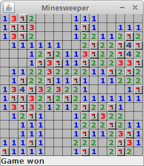

# Java-Minesweeper-Game
Java Minesweeper game source code

https://zetcode.com/javagames/minesweeper/

### Test Suite : BoardConstructorTest

**จุดประสงค์:**  
เพื่อทดสอบการทำงานของ constructor ของคลาส Board ซึ่งทำหน้าที่กำหนดค่าเริ่มต้นของเกม Minesweeper
ตั้งแต่การเตรียมทรัพยากรต่างๆ (ภาพ, กระดาน, ตัวแปรเกม) จนถึงการเชื่อมต่อกับองค์ประกอบ UI (JLabel สำหรับ status bar)

**Characteristics (Input Space Partitioning)**

| ประเภท | รายละเอียด | ค่าพารามิเตอร์ที่ทดสอบ | ผลลัพธ์ที่คาดหวัง |
|------------------------|------------------------------------------------------|------------------------|---------------------|
| **Interface-based** | พารามิเตอร์ที่ส่งเข้า Constructor (`JLabel statusbar`) | `new Board(new JLabel())` | ตรวจสอบว่าการสร้าง `Board` ด้วย status bar ภายนอกสามารถเชื่อมโยงได้ถูกต้อง (ไม่เป็น null) |
| **Interface-based** | การกำหนดขนาดของกระดาน (`PreferredSize`)              | `board.getPreferredSize()` | ตรวจสอบว่าค่าที่คืนมาคือ 241×241 ตามสูตร `(16×15)+1` |
| **Interface-based** | การโหลดภาพ sprite ทั้งหมด                            | ตัวแปร `img[]` ขนาด 13 | ตรวจสอบว่าภาพทั้ง 13 ไฟล์ถูกโหลดเข้ามาไม่เป็น null |
| **Functionality-based** | การตั้งค่าสถานะเริ่มต้นของเกม                        | ตัวแปร `inGame`        | ตรวจสอบว่าเริ่มเกมต้องเป็น `true` เสมอ |
| **Functionality-based** | การสร้างกระดานใหม่ (`field[]`)                       | ความยาวของ field = 16×16 | ตรวจสอบว่าขนาดของกระดานถูกต้องตามค่าคงที่ `N_ROWS` และ `N_COLS` |
| **Functionality-based** | การผูก Event Listener                                | `board.getMouseListeners()` | ตรวจสอบว่ามีการแนบ MouseAdapter สำหรับตรวจจับการคลิก |
| **Functionality-based** | การแสดงข้อความใน Statusbar                           | `statusbar.getText()` เท่ากับ `minesLeft` | ตรวจสอบว่าข้อความสถานะตรงกับค่าที่ระบบตั้งไว้ในเกม |

**Input Domain Modelling:**  
**Identify Testable Function(s)**
ฟังก์ชันที่ถูกทดสอบในชุดนี้คือ **Constructor ของคลาส `Board(JLabel statusbar)`**  
ซึ่งภายในจะเรียกใช้เมธอด `initBoard()` และ `newGame()` เพื่อกำหนดค่าพื้นฐานของเกม
| `Board(JLabel)` | สร้างอ็อบเจ็กต์กระดานเกมและเชื่อมกับ status bar |
| `initBoard()` | โหลดภาพ, ตั้งค่า UI, เพิ่ม MouseListener |
| `newGame()` | รีเซ็ตค่าเกม เช่น `field[]`, `inGame`, `minesLeft` |

---

**Identify Parameters, Return Types, Return Values, and Exceptional Behavior**
| **Parameter** | `JLabel statusbar` (องค์ประกอบ GUI สำหรับแสดงข้อความสถานะ) |
| **Return Type** | -|
| **Return Values** | ตัวแปรภายใน `Board` ถูกตั้งค่า เช่น `inGame=true`, `minesLeft=40`, `field[]` ถูกสร้าง, โหลดภาพครบ, และ `statusbar` แสดงข้อความ |
| **Exceptional Behavior** | หากภาพใน `src/resources/` หายหรือ `JLabel` เป็น `null` อาจเกิด `NullPointerException` |

---

**Model the Input Domain**

|Characteristic | Partition | คำอธิบาย |
|--------------------|------------|------------|
| Statusbar Parameter | {Valid JLabel, Null JLabel} | ปกติใช้ JLabel จริง, ถ้าเป็น null จะไม่สามารถเชื่อมต่อได้ |
| Resource Path | {Images Exist, Images Missing} | ปกติทุกภาพอยู่ครบใน `src/resources/` |
| Game State (inGame) | {true, false} | เริ่มเกมต้องเป็น `true` เสมอ |
| Field Initialization | {Initialized, Null} | ต้องถูกสร้างความยาว = 256 ช่อง (16×16) |
| Mines Count | {Correct=40, Incorrect} | ค่าเริ่มต้นต้องตรงกับจำนวนเหมือง |
| Listener Registration | {Listener Attached, Not Attached} | ต้องมี MouseAdapter ถูกแนบกับกระดาน |

---

**การรวม partitions เพื่อสร้าง test requirements**
> **เทคนิคที่ใช้:** ACoC (Each Choice of Combination)

| Test Case | Partition รวม | คำอธิบาย |
|--------|--------------------------------------------------------------|------------|
| C1 | (Statusbar = Valid JLabel) + (Images = Exist) + (inGame = true) | ตรวจสถานะเริ่มต้นของเกมที่ถูกต้อง |
| C2 | (Listener = Attached) + (Statusbar = Valid JLabel)           | ตรวจว่ามี MouseListener และข้อความสถานะตรง |
| C3 | (Field = Initialized) + (Mines = Correct)                    | ตรวจขนาดกระดานและจำนวนเหมือง |
| C4 | (Images = Exist) + (Field = Initialized)                     | ครอบคลุมการโหลดทรัพยากรและตั้งค่าใหม่ใน newGame() |

---

**Test Values และ Expected Values**

| Test Case | Test Values | Expected Values |
|--------|--------------|----------------|
| C1 | `new Board(new JLabel())` | `inGame=true`, `statusbar.getText()="40"` |
| C2 | `board.getMouseListeners().length > 0` | มี listener อย่างน้อย 1 ตัว |
| C3 | `field.length == 256` | Field ถูกสร้างครบทุกช่อง |
| C4 | `img.length == 13` | โหลดภาพครบทุกไฟล์ |

---

**การตรวจสอบการใช้ค่าทั้งหมดในโค้ด JUnit**
ค่าที่ออกแบบในตาราง (e) ถูกนำไปใช้จริงในโค้ด JUnit ผ่าน reflection เช่น  
`inGame`, `field[]`, `img[]`, `minesLeft`, `statusbar` → ถูก assert ทุกค่า  
ไม่มีค่าใดที่ไม่ได้ใช้

---

**การผสม Interface-based และ Functionality-based Characteristics**
การทดสอบในชุดนี้ผสมการตรวจ “อินพุตจากผู้ใช้/GUI” (interface-based) และ “พฤติกรรมภายในเกม” (functionality-based)  
เช่น ตรวจการเชื่อม `JLabel` กับสถานะในเกม, ตรวจ MouseListener, และตรวจค่าใน statusbar พร้อมกัน

---

### Test Suite : PaintComponentTest
**จุดประสงค์:**  
เพื่อทดสอบการทำงานของ **`paintComponent(Graphics g)`**  
ซึ่งรับผิดชอบในการวาด cell, ตรวจการชนะ/แพ้ของเกม และอัปเดตข้อความใน `statusbar`  
รวมถึงตรวจว่าการเลือก sprite (COVER, MARK, MINE, WRONG_MARK) ถูกต้อง

**Characteristics (Input Space Partitioning)**

| ประเภท | รายละเอียด | ค่าพารามิเตอร์ที่ทดสอบ | ผลลัพธ์ที่คาดหวัง |
|----------|-------------|----------------|-------------------|
| **Interface-based** | Graphics object | ใช้ BufferedImage.createGraphics() | จำลองการวาดโดยไม่เปิด GUI |
| **Interface-based** | Field values | {0, 9, 15, 19, 20, 29} | จำลองสถานะ cell   |
| **Functionality-based** | inGame | {true, false} | ตรวจ logic การแสดงผล |
| **Functionality-based** | uncover | {0, >0} | ตรวจ logic การชนะ |
| **Functionality-based** | sprite | {DRAW_MINE, DRAW_MARK, DRAW_WRONG_MARK, DRAW_COVER} | ตรวจ mapping sprite |

---

**Input Domain Modelling:**  
**Identify Testable Function(s)**
| `paintComponent(Graphics g)` | วาด cell, ตรวจสถานะ, เปลี่ยนข้อความ “Game won/lost” |

--- 
**Identify Parameters, Return Types, Return Values, Exceptional Behavior**
| **Parameter** | Graphics g |
| **Return Type** | void |
| **Return Values** | ไม่มี แต่มีผลต่อข้อความใน `statusbar` |
| **Exceptional Behavior** | หาก `img[cell]` เป็น null อาจเกิด NPE |

---
**Model the Input Domain**

| Characteristic | Partition | คำอธิบาย |
|----------------|------------|----------|
| `field[]` | {0, 9, 15, 19, 20, 29} | จำลองช่องแต่ละแบบ |
| `inGame` | {true, false} | ตรวจ logic จบเกม |
| `uncover` | {0, >0} | ตรวจกรณีชนะ |
| `Graphics` | {valid object} | จำลองพื้นที่วาดภาพ |

**การรวม partitions เพื่อสร้าง test requirements**
> **เทคนิค:** ECC (Each Choice Coverage)

| Test Case | Partition รวม | คำอธิบาย |
|-----|---------------|-----------|
| C1 | field=0, inGame=true | เกมชนะ (Game Won) |
| C2 | field=9, inGame=true | เกมแพ้ (Game Lost) |
| C3 | field={19,20,29}, inGame=false | !inGame (MINE/MARK/WRONG_MARK) |
| C4 | field=15, inGame=false | !inGame (DRAW_COVER) |
| C5 | field=9, inGame=true | เจอ mine ระหว่างวาด |
| C6 | field=15, inGame=true | uncover>0 (ยังเล่นอยู่) |
| C7 | field=29, inGame=true | MARK ระหว่างเล่น |

---
**Test Values และ Expected Values**

| Test Case | Test Values | Expected Values |
|-----|--------|------------|
| C1 | field=0, inGame=true | “Game won” |
| C2 | field=9, inGame=true | “Game lost” |
| C3 | field={19,20,29}, inGame=false | “Game lost” |
| C4 | field=15, inGame=false | “Game lost” |
| C5 | field=9, inGame=true | inGame=false, “Game lost” |
| C6 | field=15, inGame=true | ไม่มี “Game won/lost” |
| C7 | field=29, inGame=true | วาด MARK, ยังเล่นอยู่ |

---
**การตรวจสอบการใช้ค่าทั้งหมดในโค้ด JUnit**
ทุกค่า field[], inGame ถูกใช้จริง  
ตรวจผลลัพธ์ statusbar ทุกกรณี 
ครบทั้ง True/False branches และทุก sprite condition

---
**การผสม Interface-based และ Functionality-based Characteristics**
ใช้ Graphics จำลอง (interface) ตรวจข้อความใน statusbar (functionality) 
เซ็ตค่า field[] ด้วย reflection เพื่อกระตุ้น logic ภายใน (functionality) 

## Test Suite : FindEmptyCellsTest

**จุดประสงค์:**  
ทดสอบเมธอด (private) `find_empty_cells(int start)` ของคลาส `Board` ซึ่งเป็นแกน “flood-fill” ของ Minesweeper: เมื่อเปิดเซลล์ศูนย์ต้องลามเปิดศูนย์ติดกัน และเปิดเลขขอบเขตที่ติดกับศูนย์ (แต่เลขไม่ลามต่อ) พร้อมกับการกันขอบ/กันมุมให้ถูกต้อง และต้อง **ไม่ไปเปิดเหมือง**

---

**Characteristics (Input Space Partitioning)**

| ประเภท Characteristic | รายละเอียด (Characteristic Description) | ค่าหรือพารามิเตอร์ที่ทดสอบ | จุดประสงค์/ผลลัพธ์ที่คาดหวัง |
|------------------------|------------------------------------------|-------------------------------|--------------------------------|
| **Interface-based** | จุดเริ่มต้น (`start` index) | {Center, TopEdge, BottomEdge, LeftEdge, RightEdge, NearCorners} | กระตุ้นเงื่อนไขขอบ/นอกขอบ/ทแยงให้ครบทุกทิศ |
| **Functionality-based** | สถานะช่องรอบ ๆ ฝั่ง W/N | {AlreadyOpened(≤9), CoveredNumber(=11), CoveredZero(=10)} | ยิงทั้ง false-branch (เปิดแล้ว) และ true-branch (เลข/ศูนย์) |
| **Functionality-based** | สถานะช่องรอบ ๆ ฝั่ง E/NE | {AlreadyOpened(≤9), CoveredNumber(=11)} | ยิงเส้นทาง “เปิดเลขไม่ลาม” กับ “เปิดแล้วคงเดิม” |
| **Functionality-based** | สถานะช่องรอบ ๆ ฝั่ง SW/SE | {CoveredZero(=10)→Expand, CoveredNumber(=11)→NoExpand} | ยิงพฤติกรรม “ลาม (ศูนย์)” vs “หยุด (เลข)” |
| **Functionality-based (คงที่ร่วม)** | ความปลอดภัยของเหมือง | `(0,0)=19` | เหมืองต้องยังปิดอยู่เสมอหลังการทำงาน |

---

**Input Domain Modelling:**  
**Identify Testable Function(s)**  
ฟังก์ชันที่ถูกทดสอบในชุดนี้คือ **`find_empty_cells(int start)`** (เรียกผ่าน reflection) ภายใน `Board`  
| `find_empty_cells(int)` | เปิดเซลล์เริ่ม และทำ flood‑fill ไปยังศูนย์ที่ติดกัน พร้อมเปิดเลขขอบเขตที่ติดศูนย์ |

---

**Identify Parameters, Return Types, Return Values, and Exceptional Behavior**  
| **Parameter** | `start` (ดัชนีเซลล์ 0..255 ของตาราง 16×16) |
| **Return Type** | ไม่มี (void) |
| **Return Values (ผลลัพธ์ที่สังเกตได้)** | ค่าใน `field[]` ของจุดเริ่มและเพื่อนบ้านถูกเปลี่ยน: ศูนย์ถูกเปิดเป็น `0`, เลขถูกเปิดเป็นค่าเลขจริง (เช่น `1`), ศูนย์ติดกันขยายต่อ |
| **Exceptional Behavior** | ไม่คาดหวัง exception หาก `start` อยู่ในช่วงและ guard ขอบทำงานถูกต้อง |

---

**Model the Input Domain**

| ประเภท Characteristic | ชื่อ Characteristic | Partition | คำอธิบาย |
|------------------------|--------------------|-----------|-----------|
| **Interface-based** | Start Position (`start`) | {Center, TopEdge, BottomEdge, LeftEdge, RightEdge, NearCorners} | จุดเริ่มเปิดช่องเพื่อกระตุ้น guard/ขอบต่าง ๆ |
| **Interface-based** | Neighbor Sets Provided | {Set W/N, Set E/NE, Set SW/SE, Default(=10)} | ถ้าไม่ได้เซ็ต เพื่อนบ้านจะเป็นค่าเริ่ม `10` ทั้งกระดาน (`Arrays.fill`) |
| **Functionality-based** | W/N State | {AlreadyOpened(≤9), CoveredNumber(=11), CoveredZero(=10)} | ใช้ยิง false vs true branch |
| **Functionality-based** | E/NE State | {AlreadyOpened(≤9), CoveredNumber(=11)} | เปิดเลขแล้วไม่ลาม / เปิดแล้วคงเดิม |
| **Functionality-based** | SW/SE State | {CoveredZero(=10)→Expand, CoveredNumber(=11)→No‑Expand} | ศูนย์ลาม vs เลขหยุด |
| **Functionality-based** | Mine Safety | {Covered(=19)} | เหมือง `(0,0)` ต้องยังปิดอยู่เสมอ |

**ค่าคงที่:** `COVER_FOR_CELL=10`, `MINE_CELL=9`, `COVERED_MINE_CELL=19`, `EMPTY_CELL=0`  
ขนาดกระดาน 16×16: `N_ROWS=N_COLS=16`, `allCells=256`

---

**การรวม partitions เพื่อสร้าง test requirements**
> **เทคนิคที่ใช้:** **ACoC (All‑Combinations Coverage)**  
จากโมเดลนี้รวมได้ 6×3×2×2 = 72 TR — ด้านล่างคัด 4 เคสหลักที่ตรงกับโค้ด JUnit จริง

| Test Case | Partition ที่ใช้รวมกัน | คำอธิบาย |
|--------|-------------------------|-----------|
| C1 | (Start=Center) + (W/N=AlreadyOpened) + (E/NE=CoveredNumber) + (SW/SE=CoveredZero→Expand) | ยิงเส้นทางด้านในครบ: opened‑stay, เปิดเลขไม่ลาม, ศูนย์ลาม |
| C2 | (Start=TopEdge) + (W/N=Default=10) + (E/NE=Default=10) + (SW/SE=Default=10) | ยิง guard ขอบบน ไม่หลุด index; ลามเท่าที่ขอบอนุญาต |
| C3 | (Start=BottomEdge) + (W/N/E/NE/SW/SE=Default=10) | ยิง guard ขอบล่าง ไม่หลุด index |
| C4 | (Start=NearCorners) + (W/N/E/NE/SW/SE=Default=10) | ยิง guard มุม/ทแยงแบบรวบรัดหลายจุดในลูปเดียว |

> หมายเหตุ: ค่า “Default” มาจาก `Arrays.fill(field, 10)` ใน `@BeforeEach`

---

**Test Values และ Expected Values**

| Test Case | Test Values | Expected Values |
|--------|--------------|----------------|
| C1 | เปิด start: `field[s]=10; field[s]-=10` → `0`; ตั้งเพื่อนบ้าน: `W=0`, `N=1` (opened), `E=11`, `NE=11` (เลขปิด), `SW=10`, `SE=10` (ศูนย์ปิด); คงเหมือง `(0,0)=19` | `a[s]==0`; `W/N` คงเดิม (0,1); `E/NE` เปิดเป็นเลขจริง (เช่น `1`); `SW/SE` เปิดเป็น `0` และ **ขยาย**; `(0,0)==19` |
| C2 | `start=(0,8)`; เปิด start เป็น `0`; เพื่อนบ้านรอบ ๆ ค่าดีฟอลต์ `10`; `(0,0)=19` | `a[s]==0`; guard ทิศเหนือไม่หลุด index; `(0,0)==19` |
| C3 | `start=(15,8)`; เปิด start เป็น `0`; เพื่อนบ้านดีฟอลต์ `10`; `(0,0)=19` | `a[s]==0`; guard ทิศใต้ไม่หลุด index; `(0,0)==19` |
| C4 | start หลายชุดใกล้มุม: `(0,5)`, `(0,14)`, `(15,1)`, `(15,14)`; เปิดแต่ละ start เป็น `0`; เพื่อนบ้านดีฟอลต์ `10`; `(0,0)=19` | `a[s]==0` ทุก start; guard มุม/ทแยงทำงานถูกต้อง; `(0,0)==19` |

---

**การตรวจสอบการใช้ค่าทั้งหมดในโค้ด JUnit**  
ค่าที่ออกแบบถูกใช้จริงผ่าน reflection: เซ็ต `field[]`, `allCells`, `inGame`; เปิด `start`; กำหนดเพื่อนบ้านบางทิศ; ตรวจผล `field[]` และยืนยัน `(0,0)==19` ว่าเหมืองยังปิด

---

**การผสม Interface‑based และ Functionality‑based Characteristics**  
เทสต์ผสม “ตำแหน่งเริ่ม” (interface‑based) กับ “สถานะช่องรอบ ๆ” (functionality‑based) เพื่อครอบคลุมทั้งเส้นทางลาม/หยุดและ guard ของขอบ/มุม โดยยังคงความปลอดภัยของเหมือง

---

## Test Suite : MinesAdapterLosePathTest

**จุดประสงค์:**  
ทดสอบการทำงานของ `MinesAdapter.mousePressed(MouseEvent)` (ผ่าน `board.getMouseListeners()[0].mousePressed(e)`) ว่าเมื่อ **คลิกซ้าย** บนช่องที่เป็น **เหมืองแบบปิด** จะเกิดเส้นทางแพ้ของเกม Minesweeper อย่างถูกต้อง ได้แก่ `inGame` เปลี่ยนเป็น `false` และช่องที่คลิกถูกเปิดเป็น `MINE_CELL (=9)` โดยการคำนวณพิกัดพิกเซล → เซลล์ด้วย `CELL_SIZE` ต้องแม่นยำ และไม่กระทบเหมืองตำแหน่งอื่น

**Characteristics (Input Space Partitioning)**

| ประเภท Characteristic | รายละเอียด (Characteristic Description) | ค่าหรือพารามิเตอร์ที่ทดสอบ | จุดประสงค์/ผลลัพธ์ที่คาดหวัง |
|------------------------|------------------------------------------|-------------------------------|--------------------------------|
| **Interface-based** | ปุ่มเมาส์ที่คลิก | {Left, Right, Other} | เส้นทางแพ้ต้องเกิดเฉพาะ **Left** |
| **Interface-based** | ชนิดช่องเป้าหมายที่ถูกคลิก | {CoveredMine(=19), CoveredNumber(=11), CoveredZero(=10)} | ตรวจว่าแพ้เฉพาะ **CoveredMine** กรณีอื่นไม่แพ้ |
| **Interface-based** | ตำแหน่งช่องเหมือง (พิกัดบนกระดาน) | {Center, Edge, Corner} | ตรวจความถูกต้องของ mapping พิกเซล→เซลล์ทั้งกลาง/ขอบ/มุม |
| **Functionality-based** | สถานะเริ่มต้นของเกม | {inGame=true, inGame=false} | ถ้าเกมจบ (`false`) คลิกไม่ควรทำให้เกิดแพ้ซ้ำ |
| **Functionality-based** | ความปลอดภัยของเหมืองอื่น ๆ | (ตรึงเหมืองอื่นให้ปิดอยู่) | ไม่ควรถูกเปิดโดยอ้อมจากเหตุการณ์นี้ |

**Input Domain Modelling:**  
**Identify Testable Function(s)**  
ฟังก์ชันที่ถูกทดสอบในชุดนี้คือ **`MinesAdapter.mousePressed(MouseEvent)`** ผ่าน MouseListener ของ `Board`  
| `mousePressed(MouseEvent)` | แปลงพิกัดพิกเซล → ดัชนีเซลล์ และประมวลผลคลิกซ้าย/ขวาตามกติกา |
| การคำนวณตำแหน่งเซลล์ | ใช้ `CELL_SIZE` จาก `getPreferredSize()` เพื่อคำนวณ `(r,c)` จาก `(x,y)` |
| การอัปเดตสถานะเกม | เปลี่ยนค่า `inGame` และปรับ `field[]` ตามผลของการคลิก |

---

**Identify Parameters, Return Types, Return Values, and Exceptional Behavior**  
| **Parameter** | `MouseEvent e` (ตำแหน่งพิกเซล, ปุ่มเมาส์, click count) |
| **Return Type** | ไม่มี (void) |
| **Return Values (ผลลัพธ์ที่สังเกตได้)** | `inGame` เปลี่ยนเป็น `false` เมื่อคลิกซ้ายบน `CoveredMine`; ช่องที่คลิกถูกเปิดเป็น `MINE_CELL (=9)` |
| **Exceptional Behavior** | ไม่คาดหวัง exception หาก `MouseListener` ถูกผูกและขนาดบอร์ดถูกต้อง |

---

**Model the Input Domain**

| ประเภท Characteristic | ชื่อ Characteristic | Partition | คำอธิบาย |
|------------------------|--------------------|-----------|-----------|
| **Interface-based** | Mouse Button | {Left, Right, Other} | กำหนดเส้นทางแพ้เฉพาะ Left |
| **Interface-based** | Click Target Kind | {CoveredMine(=19), CoveredNumber(=11), CoveredZero(=10)} | ชนิดช่อง ณ ตำแหน่งที่คลิก |
| **Interface-based** | Mine Location | {Center, Edge, Corner} | ใช้ตรวจ mapping พิกเซล→เซลล์ในบริบทต่าง ๆ |
| **Functionality-based** | Game State (inGame) | {true, false} | เกมเล่นอยู่/จบแล้ว |
| **Functionality-based** | Other Mines Safety | {Covered} | เหมืองตำแหน่งอื่นยังปิดอยู่เสมอ |

---

**การรวม partitions เพื่อสร้าง test requirements**
> **เทคนิคที่ใช้:** MBCC (Multiple Base Choice Coverage)

| Test Case | Partition ที่ใช้รวมกัน | คำอธิบาย |
|--------|-------------------------|-----------|
| C1 (Base) | (Mouse=Left) + (Target=CoveredMine) + (Location=Center) + (inGame=true) | ฐานหลัก: คลิกซ้ายโดนเหมืองกลางกระดาน → ต้องแพ้ |
| C2 | (Mouse=Left) + (Target=CoveredMine) + (Location=Edge) + (inGame=true) | เบี่ยงจากฐาน: ทดสอบ mapping ใกล้ขอบ ยังแพ้ถูกต้อง |
| C3 | (Mouse=Right) + (Target=CoveredMine) + (Location=Center) + (inGame=true) | เบี่ยงจากฐาน: คลิกขวาโดนเหมือง **ไม่ควรแพ้** |
| C4 | (Mouse=Left) + (Target=CoveredMine) + (Location=Center) + (inGame=false) | เบี่ยงจากฐาน: เกมจบแล้ว คลิกไม่ควรเปลี่ยนสถานะ |

---

**Test Values และ Expected Values**

| Test Case | Test Values | Expected Values |
|--------|--------------|----------------|
| C1 | ตั้ง `field[idx(2,3)]=19` (CoveredMine); สร้าง `MouseEvent` ปุ่ม **Left** ที่พิกัดกลางเซลล์ (2,3); `inGame=true` | `inGame=false`; `field[idx(2,3)]=9` (เปิดเหมือง); ไม่มีผลข้างเคียงกับเหมืองอื่น |
| C2 | ตั้ง `field[idx(0,5)]=19`; สร้าง `MouseEvent` ปุ่ม **Left** ที่พิกัดกลางเซลล์ (0,5); `inGame=true` | `inGame=false`; `field[idx(0,5)]=9`; mapping ขอบถูกต้อง |
| C3 | ตั้ง `field[idx(2,3)]=19`; สร้าง `MouseEvent` ปุ่ม **Right** ที่พิกัดกลางเซลล์ (2,3); `inGame=true` | **ไม่แพ้** (`inGame=true`); ค่าใน `field` ไม่ถูกเปิดเป็น 9 |
| C4 | ตั้ง `field[idx(2,3)]=19`; สร้าง `MouseEvent` ปุ่ม **Left** ที่พิกัดกลางเซลล์ (2,3); `inGame=false` | **ไม่แพ้** (`inGame=false` คงเดิม); ไม่ควรเปิดเป็น 9 |

---

**การตรวจสอบการใช้ค่าทั้งหมดในโค้ด JUnit**  
ค่าที่ออกแบบในตารางถูกใช้จริงในยูนิตเทสต์ เช่น การตั้ง `field[]` ให้เป็น `10` ทั้งกระดาน, วาง `CoveredMine (=19)` ณ จุดทดสอบ, คำนวณ `CELL_SIZE` จาก `getPreferredSize()` เพื่อสร้าง `MouseEvent` ที่ตำแหน่งกลางเซลล์, ตรวจ `inGame` และค่าเซลล์หลังคลิก

---

**การผสม Interface-based และ Functionality-based Characteristics**  
การทดสอบชุดนี้ผสมทั้งมุมมองผู้ใช้ (ปุ่มคลิก, ตำแหน่งที่คลิก, ชนิดช่อง) กับพฤติกรรมภายใน (สถานะเกม, การเปลี่ยนค่า `field[]`) เพื่อยืนยันเส้นทางแพ้และกรณีไม่แพ้ตามกติกา Minesweeper

---

## Test Suite : ComputeAdjacencyTest

**จุดประสงค์:**
ยืนยันว่า `computeAdjacency()` คำนวณตัวเลขรอบเหมือง 8 ทิศได้ถูกต้อง (เหมือง = −1, อื่น = 0..8) ครอบคลุมกรณีมุม/ขอบ/กึ่งกลาง และเช็กพารามิเตอร์ผิดพลาด

**Characteristics (Input Space Partitioning)**

| ประเภท Characteristic   | รายละเอียด        | ค่าหรือพารามิเตอร์ที่ทดสอบ         | จุดประสงค์/ผลลัพธ์ที่คาดหวัง                 |
| ----------------------- | ----------------- | ---------------------------------- | -------------------------------------------- |
| **Interface-based**     | ขนาดกระดาน        | `rows ∈ {1, >1}`, `cols ∈ {1, >1}` | ครอบคลุม 1×1, 1×N, M×1, M×N                  |
| **Interface-based**     | ความยาว `mines[]` | {เท่ากับ `rows*cols`, ไม่เท่า}     | ถ้าไม่เท่า → ต้อง `IllegalArgumentException` |
| **Functionality-based** | ตำแหน่งเหมือง     | {มุม, ขอบ, กึ่งกลาง, ไม่มี, เต็ม}  | ตรวจการนับรอบข้างและไม่หลุดขอบ               |
| **Functionality-based** | รูปแบบกระจาย      | {เดี่ยว, ทแยงติดกัน, หนาแน่น}      | ตรวจผลรวมเพื่อนบ้านเมื่อเหมืองอยู่ใกล้กัน    |

**Input Domain Modelling — Identify Testable Function(s)**

| ฟังก์ชัน                                                | บทบาท                                             |
| ------------------------------------------------------- | ------------------------------------------------- |
| `computeAdjacency(int rows, int cols, boolean[] mines)` | คืน `int[]` ขนาด `rows*cols` ตามกติกา Minesweeper |

**Identify Parameters, Return Types, Return Values, and Exceptional Behavior**

| รายการ               | รายละเอียด                                                                        |
| -------------------- | --------------------------------------------------------------------------------- |
| Parameters           | `rows`, `cols`, `mines[]`                                                         |
| Return type          | `int[]`                                                                           |
| Return values        | −1 (เหมือง) หรือ 0..8 (จำนวนรอบข้าง)                                              |
| Exceptional Behavior | `rows<=0`/`cols<=0` หรือ `mines.length != rows*cols` → `IllegalArgumentException` |

**Model the Input Domain**

| ชื่อ Characteristic | Partition                         |
| ------------------- | --------------------------------- |
| Rows                | {1, >1}                           |
| Cols                | {1, >1}                           |
| Mines length        | {ถูกต้อง, ไม่ถูกต้อง}             |
| Mine position       | {มุม, ขอบ, กึ่งกลาง, ไม่มี, เต็ม} |
| Pattern             | {เดี่ยว, ทแยงติดกัน, หนาแน่น}     |

**การรวม partitions เพื่อสร้าง test requirements**

> **เทคนิคที่ใช้:** **PWC (Pair-Wise Coverage)** — ให้ทุก “คู่” ของลักษณะเกิดขึ้นอย่างน้อย 1 ครั้ง

| Test Case | Partition ที่ใช้รวมกัน                                        | คำอธิบาย                           |
| --------- | ------------------------------------------------------------- | ---------------------------------- |
| P1        | Rows>1, Cols>1, Len=ถูกต้อง, Pos=กึ่งกลาง, Pattern=ทแยงติดกัน | ตาราง 4×4 วางเหมืองแนวทแยง 2 จุด   |
| P2        | Rows>1, Cols>1, Len=ถูกต้อง, Pos=มุม+กึ่งกลาง, Pattern=เดี่ยว | ตาราง 3×3 มุมซ้ายบน + กลาง         |
| P3        | Rows=1, Cols=1, Len=ถูกต้อง, Pos=ไม่มี                        | 1×1 ไม่มีเหมือง → ต้องได้ 0        |
| P4        | Rows=1, Cols>1, Len=ถูกต้อง, Pos=มุม                          | 1×N เหมืองที่ขอบซ้าย/ขวา           |
| P5        | Rows>1, Cols=1, Len=ถูกต้อง, Pos=ขอบ                          | M×1 เหมืองที่ขอบบน/ล่าง            |
| P6        | Rows>1, Cols>1, **Len=ไม่ถูกต้อง**                            | ต้องโยน `IllegalArgumentException` |
| P7        | Rows>1, Cols>1, Len=ถูกต้อง, **Pos=เต็ม**                     | ทุกช่องเป็นเหมือง → ทั้งแผง −1     |

**Test Values และ Expected Values**

| Test Case | Test Values                    | Expected Values                             |
| --------- | ------------------------------ | ------------------------------------------- |
| P1        | 4×4; mines ที่ (1,1) และ (2,2) | ผลลัพธ์ตรงกับ `custom4x4_twoMines_diagonal` |
| P2        | 3×3; mines ที่ (0,0) และ (1,1) | ผลลัพธ์ตรงกับ `custom3x3_centerAndCorner`   |
| P3        | 1×1; mines=false               | `[0]`                                       |
| P4        | 1×4; mine @0                   | มีเพื่อนบ้านเฉพาะด้านขวา                    |
| P5        | 4×1; mine @1                   | มีเพื่อนบ้านเฉพาะบน/ล่าง                    |
| P6        | 3×3; `mines.length=7`          | โยน `IllegalArgumentException`              |
| P7        | 3×3; all mines=true            | ทุกค่าเป็น −1                               |

**การตรวจสอบการใช้ค่าทั้งหมดในโค้ด JUnit**  
ชุด P1–P7 ครอบคลุมทุก partition ทั้งค่าปกติและค่าผิดพลาด

**การผสม Interface-based และ Functionality-based**  
ผสาน “ขนาดและความยาวอาร์เรย์” (interface) กับ “ตำแหน่ง/รูปแบบเหมือง” (functionality) เพื่อเห็นผลกระทบร่วมกันแบบคู่ ๆ

---

## Test Suite : MinesweeperInitUITest 

**จุดประสงค์:**
ยืนยันว่า `initUI()` ประกอบหน้าจอครบ: มี `statusbar` (JLabel) ที่ SOUTH, มี `Board(statusbar)` ที่ CENTER, ตั้ง `setResizable(false)`, เรียก `pack()` และทำงานบน EDT

**Characteristics (Input Space Partitioning)**

| ประเภท Characteristic   | รายละเอียด               | ค่าหรือพารามิเตอร์ที่ทดสอบ          | จุดประสงค์/ผลลัพธ์ที่คาดหวัง             |
| ----------------------- | ------------------------ | ----------------------------------- | ---------------------------------------- |
| **Interface-based**     | Layout ของ `contentPane` | {**BorderLayout**(base), อื่น}      | ต้องเป็น BorderLayout                    |
| **Interface-based**     | องค์ประกอบ SOUTH         | {**มี JLabel**(base), ไม่มี}        | SOUTH ต้องเจอ `JLabel`                   |
| **Interface-based**     | องค์ประกอบ CENTER        | {**มี Board**(base), ไม่มี/ผิดชนิด} | CENTER ต้องเป็น `Board`                  |
| **Functionality-based** | Resizable                | {**false**(base), true}             | ต้อง `false`                             |
| **Functionality-based** | pack()                   | {**ถูกเรียก**(base), ไม่เรียก}      | หลัง `validate()` ขนาด = `preferredSize` |
| **Functionality-based** | Thread                   | {**EDT**(base), non-EDT}            | ควรทำงานบน EDT                           |

**Input Domain Modelling — Identify Testable Function(s)**

| ฟังก์ชัน   | บทบาท                                                                                     |
| ---------- | ----------------------------------------------------------------------------------------- |
| `initUI()` | ประกอบ UI: ใส่ statusbar/Board, setResizable(false), pack(), ตั้ง title/location/close op |

**Identify Parameters, Return Types, Return Values, Exceptional Behavior**

| รายการ               | รายละเอียด                              |
| -------------------- | --------------------------------------- |
| Parameters           | ไม่มี                                   |
| Return type          | `void`                                  |
| Return values        | ตรวจได้จากคอมโพเนนต์และคุณสมบัติของเฟรม |
| Exceptional Behavior | รันใน headless → ควร **skip** เทสต์     |

**Model the Input Domain**

| ชื่อ Characteristic | Partition                        |
| ------------------- | -------------------------------- |
| Layout              | {**BorderLayout**(base), อื่น}   |
| SOUTH component     | {**JLabel**(base), ไม่มี}        |
| CENTER component    | {**Board**(base), ไม่มี/ผิดชนิด} |
| Resizable           | {**false**(base), true}          |
| pack                | {**เรียก**(base), ไม่เรียก}      |
| Thread              | {**EDT**(base), non-EDT}         |

**การรวม partitions เพื่อสร้าง test requirements**

> **เทคนิคที่ใช้:** **BCC (Base-Choice Coverage)** — มีเคสฐาน แล้ว “เปลี่ยนทีละอย่าง” เพื่อพิสูจน์ข้อกำหนด

| Test Case | Partition รวม                                                                            | คำอธิบาย                           |
| --------- | ---------------------------------------------------------------------------------------- | ---------------------------------- |
| B0 (Base) | Layout=BorderLayout, SOUTH=JLabel, CENTER=Board, Resizable=false, pack=เรียก, Thread=EDT | เคสฐานที่ต้องผ่าน (เทสต์ที่มีอยู่) |
| B1        | SOUTH=ไม่มี                                                                              | SOUTH ไม่เจอ `JLabel`              |
| B2        | CENTER=ไม่มี/ผิดชนิด                                                                     | CENTER ไม่ใช่ `Board`              |
| B3        | Resizable=true                                                                           | `isResizable()` เป็น true          |
| B4        | pack=ไม่เรียก                                                                            | ขนาดจริง ≠ `preferredSize`         |
| B5        | Thread=non-EDT                                                                           | บังคับให้ fail/skip ตาม policy     |

**Test Values และ Expected Values**

| Test Case | Test Values                                                                                      | Expected Values                 |
| --------- | ------------------------------------------------------------------------------------------------ | ------------------------------- |
| B0        | สร้าง `Minesweeper` บน EDT; ตรวจ SOUTH/CENTER; ตรวจ `isResizable=false`; ตรวจ size=preferredSize | ผ่านทั้งหมด                     |
| B1        | เฟรมจำลองไม่เพิ่ม SOUTH                                                                          | ไม่พบ `JLabel` SOUTH            |
| B2        | เฟรมจำลองไม่เพิ่ม CENTER หรือใส่ชนิดอื่น                                                         | ไม่ใช่ `Board`                  |
| B3        | เฟรมจำลองตั้ง `setResizable(true)`                                                               | Assertion ว่าต้อง false ล้ม     |
| B4        | เฟรมจำลองไม่เรียก `pack()`                                                                       | size ไม่เท่ากับ `preferredSize` |
| B5        | เรียกจาก non-EDT หรือ headless                                                                   | skip/fail                       |

**การตรวจสอบการใช้ค่าทั้งหมดในโค้ด JUnit**  
B0 ตรวจครบองค์ประกอบ; B1–B5 ปรับทีละจุดเพื่อยืนยันข้อกำหนดของ `initUI()` ตาม BCC

**การผสม Interface-based และ Functionality-based**  
ตรวจโครงสร้างคอมโพเนนต์ (interface) ร่วมกับคุณสมบัติและพฤติกรรมของเฟรม (`isResizable`, `pack`, เธรด) ที่เป็น functionality

---

## Test Suite : MinesAdapterWinPathTest (PWC)

**จุดประสงค์:**  
ตรวจสอบการทำงานของ `MinesAdapter.mousePressed(MouseEvent)` ในทุกกรณีที่อาจเกิดขึ้นระหว่าง “เส้นทางชนะ (Win Path)”  
เน้นการทดสอบ *ปฏิสัมพันธ์ระหว่างปัจจัยสองตัวขึ้นไป* เช่น ปุ่มเมาส์ + ชนิดช่อง, ตำแหน่งคลิก + สถานะเกม, หรือ uncover + การปักธง

> ใช้ **Pair-Wise** เพราะต้องการครอบคลุมความสัมพันธ์ระหว่างอินพุตต่าง ๆ โดยไม่ต้องทดสอบทุกคอมบินาชัน (ซึ่งเยอะมาก)

### Characteristics (Input Space Partitioning)

| ประเภท Characteristic   | Characteristic        | รายละเอียด | พาร์ติชัน (Partitions) |
|-------------------------|-----------------------|---|---|
| **Interface-Based**     | **Mouse Button**      | ปุ่มที่ใช้คลิก | {Left, Right, Other} |
| **Interface-Based**     |**Click Target Kind** | ชนิดของช่องที่คลิก | {CoveredZero, CoveredNumber, Marked, Opened} |
| **Interface-Based**     |**Click Location**    | พิกัดบนกระดาน | {Center, Edge, Corner, OutOfBoard} |
| **Functionality-Based** |**Game Status (inGame)** | สถานะเกม | {True, False} |
| **Functionality-Based** |**Remaining uncover count** | จำนวนช่องปลอดภัยที่ยังไม่เปิด | {LastOne, ManyLeft} |
| **Functionality-Based** | **Mark Handling**     | การจัดการธง | {NoMarkAction, ToggleMark} |

### Identify Testable Function(s)

| ฟังก์ชัน | บทบาท |
|---|---|
| `mousePressed(MouseEvent e)` | ประมวลผลคลิกซ้าย/ขวา, แปลงพิกัดพิกเซล → ช่อง, เปิด/ปักธง |
| (ใน Board) | ตรวจชนะ/แพ้ (`uncover==0`), อัปเดต `statusbar`, ปรับ `inGame` |

### Parameters / Return / Exceptional Behavior

- **Parameter:** `MouseEvent e`
- **Return:** ไม่มี (ตรวจผ่านสถานะ/ผลลัพธ์)
- **Exceptional Behavior:** ไม่ควรเกิด exception แม้คลิกนอกบอร์ด

### Model the Input Domain

| Characteristic | พาร์ติชัน |
|---|---|
| Mouse Button | {Left, Right, Other} |
| Click Target Kind | {CoveredZero, CoveredNumber, Marked, Opened} |
| Click Location | {Center, Edge, Corner, OutOfBoard} |
| Game Status | {True, False} |
| Remaining uncover | {LastOne, ManyLeft} |
| Mark Handling | {NoMarkAction, ToggleMark} |

### การสร้าง Test Requirements — **PWC**

> สร้างเคสให้ครอบคลุมทุก “คู่ (pair)” ของลักษณะ อย่างน้อย 1 ครั้ง โดยยังคงจำนวนเคสให้น้อย

| Test Case | พาร์ติชันรวม (Pair-wise ครอบคลุม) | จุดตรวจหลัก |
|---|---|---|
| **P1** | Mouse=Left, Target=CoveredZero, Loc=Center, inGame=True, uncover=LastOne, Mark=NoMarkAction | เคสชนะเกมปกติ (Win Path): เปิดช่องสุดท้าย → `inGame=false`, “Game won”. |
| **P2** | Mouse=Left, Target=CoveredNumber, Loc=Edge, inGame=True, uncover=LastOne | ช่องสุดท้ายเป็นเลข → ชนะได้เช่นกัน. |
| **P3** | Mouse=Right, Target=Marked, Loc=Corner, inGame=True, uncover=ManyLeft | ปักธงในมุม → ไม่ควรเปิดช่อง. |
| **P4** | Mouse=Right, Target=CoveredZero, Loc=Center, inGame=True, uncover=ManyLeft | คลิกขวา toggle mark/unmark ถูกต้อง. |
| **P5** | Mouse=Left, Target=Marked, Loc=Center, inGame=True, uncover=LastOne | ช่องสุดท้ายถูกปักธง → ไม่ชนะจนกว่าจะ unmark. |
| **P6** | Mouse=Left, Target=CoveredZero, Loc=OutOfBoard, inGame=True | คลิกนอกบอร์ด → ไม่มีผล. |
| **P7** | Mouse=Left, Target=CoveredZero, Loc=Center, inGame=False | เกมจบแล้ว → คลิกซ้ำไม่เปลี่ยน state. |
| **P8** | Mouse=Other, Target=CoveredZero, Loc=Edge, inGame=True | ปุ่มอื่นนอกจากซ้าย/ขวา → ไม่มีผล. |

### Expected Results Summary

| Test Case |Test Values| Expected Outcome                                   |
|-----------|-|----------------------------------------------------|
| P1        | ตั้ง field[idx(5,7)]=10 (CoveredZero); uncover=1; inGame=true; สร้าง MouseEvent Left ที่พิกัดกลางเซลล์ (5,7) → (112,82)| ชนะ → inGame=false; statusbar="Game won"; ช่อง (5,7) เปิดเป็น 0; uncover→0 |
| P2        | ตั้ง field[idx(0,5)]=11 (CoveredNumber); เพื่อนบ้านจำลองให้เป็นเลข; uncover=1; inGame=true; Left ที่ (0,5) → (82,7)| ชนะ → inGame=false; statusbar ชนะ; ช่อง (0,5) เปิดเป็นเลข 1..8; uncover→0                |
| P3        | ตั้ง field[idx(0,0)]=29 (Marked); uncover=10; inGame=true; Right ที่ (0,0) → (7,7)| ไม่เปิด; toggle ธง (29↔10 ตามดีไซน์); ปรับ minesLeft (+/−1); inGame=true                 |
| P4        | ตั้ง field[idx(8,3)]=10; uncover=20; inGame=true; Right ที่ (8,3) → (52,127)| mark ช่อง → (10→29); minesLeft→39; ไม่เปิด; inGame=true                             |
| P5        | ตั้ง field[idx(6,6)]=29 (Marked); uncover=1; inGame=true; Left ที่ (6,6) → (97,97)| ไม่ชนะ; ช่องไม่เปิดเพราะถูก mark; inGame=true; uncover คงเดิม                          |
| P6        | ตั้ง field[idx(5,7)]=10; uncover=1; inGame=true; Left ที่ OutOfBoard → (-5,10)| ถูกเมิน; ไม่เปลี่ยนแปลงใดๆ; inGame=true; statusbar คงเดิม; uncover คงเดิม                        |
| P7        | ตั้ง field[idx(5,7)]=10; uncover=1; inGame=false; Left ที่ (5,7) → (112,82)| เกมจบแล้ว → ไม่มีผล; inGame=false; statusbar คงเดิม                   |
| P8        | ตั้ง field[idx(0,1)]=10; uncover=1; inGame=true; ปุ่ม Other ที่ Edge (0,1) → (22,7)| No-op; ปุ่มไม่รองรับ → ไม่มีการเปลี่ยนแปลง; inGame=true; uncover คงเดิม                                     |

### วิธีทดสอบ (JUnit แนวทาง)

- ตั้งค่า `field[]`, `uncover`, `inGame` ตามเคส
- สร้าง `MouseEvent` จาก `(x, y)` ที่คำนวณจาก `CELL_SIZE`
- เรียก `mousePressed(e)`
- ตรวจค่า `inGame`, `statusbar`, `field[]`, และ `uncover`

> เหตุผลที่ใช้ PWC:
> - มีหลายมิติที่ส่งผลกัน (เช่น เมาส์กับช่อง, ช่องกับ uncover)
> - Pair-Wise ช่วยลดเคสจาก ~200 เหลือเพียง ~8 แต่ยังครอบคลุมทุกคู่ที่สำคัญ

---

## Test Suite : BoardInitTest (BCC)

**จุดประสงค์:**  
ทดสอบว่า `initBoard()` และการเริ่มเกม (`newGame()`) ตั้งค่าทุกส่วนได้ถูกต้อง (UI, ขนาด, listener, mines, field)  
โดยใช้ **Base-Choice Coverage** — เริ่มจาก “สภาพปกติสมบูรณ์” แล้วเบี่ยงทีละมิติ

### Characteristics (Input Space Partitioning)

| ประเภท Characteristic   |  Characteristic           | พาร์ติชัน |
|-------------------------|-------------------------------|---|
| **Interface-Based**     | **Resource Availability**     | {ImagesExist, ImagesMissing} |
| **Functionality-Based** | **Board Dimension Constants** | {Default16×16, CustomSmaller(8×8)} |
| **Interface-Based**     | **Listener Attachment**       | {Attached, Missing} |
| **Interface-Based**     | **Statusbar Wiring**          | {Linked, Null} |
| **Functionality-Based**   | **Initial Mines Count**       | {Correct(40), Wrong} |
|  **Functionality-Based**    | **Field Allocation**          | {Allocated, NotAllocated} |

### Identify Testable Function(s)

| ฟังก์ชัน | บทบาท |
|---|---|
| `initBoard()` | โหลดภาพ, ตั้ง preferred size, ผูก MouseAdapter |
| `newGame()` | สร้าง field[], ตั้งค่า inGame/minesLeft/uncover |

### Parameters / Return / Exceptional Behavior

- ไม่มีพารามิเตอร์
- Return: `void`
- Exceptional: ต้องไม่ NPE ถ้าภาพหายหรือ statusbar เป็น null

### Base-Choice Model

ตั้งค่า “ฐาน (Base Case)” คือทุกอย่างปกติถูกต้อง แล้วเบี่ยงทีละมิติ

**Base Case (B0):**
- ImagesExist
- Dimension=Default16×16
- Listener=Attached
- Statusbar=Linked
- MinesCount=Correct
- Field=Allocated

### Test Cases — **BCC**

| Test Case | พาร์ติชันจาก Base            | จุดตรวจหลัก |
|---|------------------------------|---|
| **B0 (Base)** | –                            | โหลดภาพครบ, ขนาดถูก, listener ผูกครบ, field ถูกสร้าง, minesLeft=40, statusbar อัปเดต |
| **B1** | Resource=ImagesMissing       | ตรวจว่าไม่ crash/NPE, ส่วนอื่นยังถูกต้อง |
| **B2** | Dimension=CustomSmaller(8×8) | preferredSize และ field.length ต้องลดลง (64 ช่อง) |
| **B3** | Listener=Missing             | `getMouseListeners().length==0` |
| **B4** | Statusbar=Null               | ไม่ NPE, ไม่อัปเดตข้อความ |
| **B5** | MinesCount=Wrong             | ค่าไม่ตรง, แสดงข้อความหรือ assert fail |
| **B6** | Field=NotAllocated           | field[] เป็น null หรือขนาดไม่ถูกต้อง → fail |

### Expected Results Summary

| Test Ccase | Test Values                                                                                                                                | Expected                                                                   |
|------------|--------------------------------------------------------------------------------------------------------------------------------------------|----------------------------------------------------------------------------|
| B0         | Resource=ImagesExist; Dimension=16×16 → `preferredSize=(241,241);` Listener=Attached; Statusbar=Linked; Mines=Correct(40); Field=Allocated | ทุกค่าถูกต้อง (`field.length=256`, `inGame=true`, listener>0, minesLeft=40) |
| B1         | เปลี่ยนเป็น Resource=ImagesMissing (mock ให้โหลดรูปไม่เจอ); อื่นๆเหมือนฐาน                                                                 | ไม่ crash; listener และขนาดยังถูกต้อง                                      |
| B2         | เปลี่ยนเป็น Dimension=8×8 ก่อน init; อื่นๆเหมือนฐาน                                                                                        | ขนาด UI และ field สอดคล้อง 8×8                                             |
| B3         | เปลี่ยนเป็น Listener=Missing (override ไม่ addMouseListener); อื่นๆเหมือนฐาน                                                               | ไม่มี listener                                                             |
| B4         | เปลี่ยนเป็น Statusbar=Null (`new Board(null)`); อื่นๆเหมือนฐาน                                                                             | ไม่มีข้อความใน statusbar, ไม่ crash                                        |
| B5         | เปลี่ยนเป็น Mines=Wrong (เช่น หลัง init แก้ `minesLeft=39` ผ่าน reflection/subclass); อื่นๆเหมือนฐาน                                       | ค่า minesLeft ไม่ถูกต้อง, assert fail                                      |
| B6         | เปลี่ยนเป็น `Field=NotAllocated` (override `newGame()` ไม่ `new field[]`); อื่นๆเหมือนฐาน                                                  | Fail: `field==null` หรือ `length != N_ROWS*N_COLS;` ทดสอบการสร้าง field ผิดพลาด                                        |

### เหตุผลที่ใช้ BCC
- `initBoard()` มีสถานะเริ่มต้นชัดเจน → สร้างเคสฐานง่าย
- การเบี่ยงทีละมิติ (resource/size/listener/statusbar/field) ช่วย pinpoint บั๊กแยกส่วนได้
- ครอบคลุมครบโดยไม่ต้องทดสอบทุก combination

---
